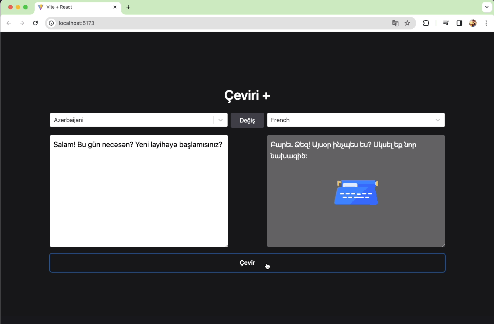

<h1>Çeviri Uygulaması</h1>

Bu proje, kullanıcıların metinleri farklı dillere çevirebilecekleri basit bir çeviri uygulamasıdır. Kullanıcılar, kaynak dil ve hedef dil seçeneklerini belirleyerek metinlerini çevirebilirler.

<h2> Özellikler</h2>

- Kullanıcılar, çevirilecek metni giriş alanına yazabilirler.
- Kullanıcılar, kaynak dil ve hedef dil seçeneklerini birer açılır menü kullanarak belirleyebilirler.
- Kullanıcılar, çevir butonuna tıklayarak metni çevirebilirler.
- Kullanıcılar, çeviri işlemi sırasında bir yüklenme animasyonu ile bilgilendirilirler.
- Kullanıcılar, çeviri sonucunu ekranda görebilirler.

<h2> Kullanılan Teknolojiler</h2>

- React
- Redux Toolkit
- Axios
- Tailwind CSS

<h2>Ekran Görüntüsü</h2>

